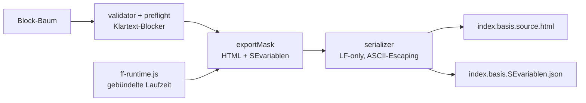
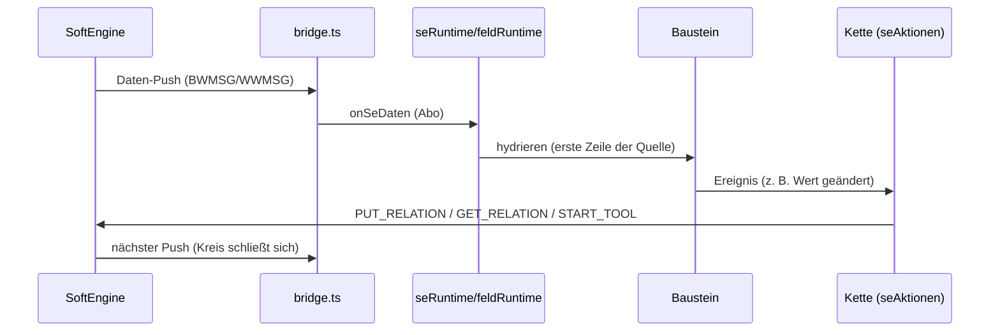

# ARCHI.md — Aufbau-Editor (EditorAufbau)

> Architektur-Karte für Mensch und KI-Agenten (Claude, Codex). Sie beschreibt,
> WAS wo liegt und WIE die Teile zusammenspielen. Regeln, Entscheidungen und
> Projektstand leben in `CLAUDE.md` — bei Widerspruch gewinnt CLAUDE.md bzw.
> der Nutzer. Pflege dieser Datei: siehe `docs/ARCHI-rules.md`.

## 1. Überblick

Visueller Baukasten für **SoftEngine-ERP-Masken**: Bausteine (Kanban,
Formularfeld, Schaltfläche, Popup, …) werden auf eine Fläche gezogen, an
ERP-Daten gebunden und als fertiges Paar **HTML + SEvariablen-JSON**
exportiert. Das Ergebnis läuft in SoftEngine (BüroWARE/WEBWARE) **ohne
Nachbesserung von Hand**.

Kernversprechen (beweisbar, nicht behauptet): **Was im Editor zu sehen ist,
IST der Export** — dieselben Web Components rendern im Editor und in der
exportierten Maske (eine Render-Quelle).

Projekt-Typ: **Web-Frontend (React-Editor)**, Besonderheit: der Editor ist
zugleich ein **Code-Generator** — die Export-Pipeline und die mitreisende
Laufzeit (`ff-runtime`) sind gleichwertige Architektur-Säulen neben der
Editor-Oberfläche.

## 2. Technologie-Stack

| Bereich | Technik | Zweck |
| --- | --- | --- |
| Editor-UI | React 19 + TypeScript 6 | Oberfläche (Canvas, Inspector, Steuerung) |
| Bausteine | Lit 3 (Web Components) | EINE Render-Quelle für Editor UND Export |
| Build | Vite 8 (`vite.config` + `vite.runtime.config`) | Dev-Server, App-Build, Runtime-Bündel |
| Styling Editor | Tailwind 3 + shadcn-Muster (radix, cva, lucide) | helles, blaues Editor-UI |
| Styling Masken | eigene CSS-Tokens (`--se-*`) | kantiges, grünes SoftEngine-Design |
| Tests | Vitest 4 (Unit/Snapshot) | fünf Wächter + Prüfbündel (Playwright/e2e entfernt 2026-07-23) |
| Version | `package.json` (`0.3.1`) | SemVer |

## 3. Projektstruktur

```
src/
├── app/            App-Einstieg; providers.tsx erzeugt DIE eine Editor-Instanz
│                   (EditorProvider/EditorContext — keine Weltvariable)
├── state/          Editor.ts = Zustand + öffentliche Methoden; Fächer daneben:
│                   treeOps (Baum), history (Undo), persistence (Browser-
│                   Speicher + Notfallkopie BACKUP_KEY), migrations, templateRules,
│                   pageOps (Seiten + Fluss-Kinder), rasterOps (Zelle/Größe/
│                   Einfügen), selectionOps (Aufklapp-Auswahl),
│                   quellenOps (welche Datenquellen sind an dieser Stelle des
│                   Baums zu haben — DIESELBE Antwort für Editor UND Preflight).
│                   Die Fächer RECHNEN nur: Baum rein, neuer Baum raus
│                   (null = nichts zu tun). Zustand halten, Historie schreiben
│                   und melden macht allein Editor.ts — ein Horchposten,
│                   eine Meldestelle. Daneben die Ablagen der maskenweiten
│                   Daten: DataSourceStore, RelationStore
│                   (je mit use*-Haken), Subject = der kleine Melder.
│                   maskenDatei = DIE eine Stelle für das Dateiformat
│                   („Maske speichern/laden": Baum + die zwei Bibliotheken;
│                   nutzt DIESELBE Lade-Kette wie der Browser-Speicher,
│                   `persistence.baumAusRohdaten` — ein Prüf-Eingang, zwei
│                   Quellen). Laden ersetzt alles und LEERT die Historie.
│                   notfallkopie = DIE eine Stelle für Speicher-Pannen, beide
│                   Richtungen: LESEN kaputt → erst Rohdaten sichern
│                   (BACKUP_KEY), dann Klartext; SCHREIBEN kaputt → Klartext
│                   EINMAL je Störungsphase, Merker je Speicherschlüssel, nach
│                   Erfolg zurückgesetzt. Genutzt von persistence UND den zwei
│                   Ablagen (Schreib-Hälfte seit 2026-07-28, Befund B3).
├── core/
│   ├── blocks/     Registry-KONZEPTE: BlockDefinition (Fähigkeiten wie
│   │               allowedChildTypes, bindableSpots, actionValueSpots,
│   │               blockEvents, acceptsDataSource, resizableWidth/Height,
│   │               listenBindung, raster …); bindingProp/bindingAttr = das
│   │               Helferpaar für die EINE Bindungs-Attribut-Form
│   └── data/       Aktionsketten-MODELL (Ereignis → Schritte, echte Union der
│                   Schritt-Arten) + Datenquellen-Modell (dataSources) +
│                   Schlüsselregel/weitere Quellen am Baustein (sourceLinks:
│                   1–3 Schlüsselpaare, UND-verknüpft; kein Partner → kein Wert)
├── blocks/         Die Bausteine, je Ordner: Definition + Web Component
│   ├── base/       Gemeinsames (BlockHost-Anbindung)
│   ├── kanban/     Kanban + Spalte + Karte; seRuntime.ts = Kanban-Hydrierung
│   ├── card/       Karte (acht bindbare Stellen, LEER-Regel, tierIcon.ts)
│   ├── formfeld/   Formularfeld (bindbar, feldRuntime = Feld-Hydrierung)
│   ├── tabelle/    Tabelle (datengetrieben): spalten.ts = Spalten-Modell,
│   │               sortierung.ts, suche.ts = Inhaltssuche, tabelleStil.ts,
│   │               seRuntime.ts = Tabellen-Hydrierung
│   ├── datum/      TAGESWÄHLER der Maske (‹ Datum › + Heute). Ohne eigene
│   │               Eigenschaften: keine Quelle, keine Bindung. Er setzt den
│   │               Tag, nach dem Kanban/Tabelle filtern ("Tag filtern nach")
│   ├── button/     Schaltfläche (trägt Aktionsketten)
│   ├── popup/      Popup-Seite (pageBlock: zentriertes Fenster, X, Abdunklung)
│   ├── text/       statisches Atom ff-text (Größe/Gewicht/Ausrichtung frei)
│   ├── trenner/    statisches Atom ff-trenner (1px-Linie, keine Eigenschaften)
│   ├── zeile/      Zeilen-Layout
│   └── shared/     seAktionen.ts = Ketten-LAUFZEIT (Schritte ausführen);
│                   datenAnschluss.ts = DIE Anmelde-/Neuzeichnen-Mechanik;
│                   gewaehlterTag.ts = DER Tag der Maske (Tageswähler setzt,
│                   datengetriebene Bausteine horchen — keiner kennt den
│                   anderen); tagFilter.ts = DIE Regel "nur Sätze dieses
│                   Tages"; datumSchluessel.ts = DIE Übersetzung deutsch ↔ ISO
├── softengine/     Die SoftEngine-SCHICHT (kennt NIE einen Baustein):
│   ├── bridge.ts   Anmeldung basisHTML_REGISTER, Daten-Push, Abo-Punkt
│   │               onSeDaten, Diagnose-Overlay (Strg+Alt+D)
│   ├── data.ts     getField/setField (Präfix-Scan), rowsFor, Quellen
│   ├── relations.ts Vorlagen (GET/PUT/PUTADD), serielle GET-Warteschlange
│   └── meldung.ts  Fehlerbalken der MASKE: gescheiterte Lese-/Schreibwege
│                   melden Klartext statt still '' zu liefern
├── editor/         Editor-Oberfläche (NICHT im Export):
│   ├── canvas/     Fläche, CanvasNode, Drag&Drop (dndState), Seiten-Reiter
│   │               (SeitenLeiste/PopupSeite), Anfasser (zieheGroesse = DIE
│   │               eine Zieh-Mechanik), useBlockResize;
│   │               FeldBindung = DIE eine Stelle „Stelle anklicken → Feld
│   │               wählen" (beide Picker-Fälle: feste Stellen UND
│   │               Listen-Einträge wie Tabellenspalten), FieldPicker zeigt
│   │               je Datenquelle des Bausteins eine Gruppe
│   ├── inspector/  Eigenschaften-Panel (nur für Unzeigbares);
│   │               QuellenListe = die Datenquellen EINES Bausteins
│   │               („+ Datenquelle", ab Eintrag 2 mit Schlüsselregel)
│   ├── zentrale/   Steuerung: Datenquellen | Relationen (Master-Detail);
│   │               StepForm (Schritt-Formular) blättert im Inspector auf;
│   │               feldUebernahme.ts + FeldUebernahmePicker.tsx = „Feld
│   │               übernehmen" (Pos/Länge/Tabelle aus gewähltem Feld,
│   │               Auslöser an der Parameter-Zeile, editor-only)
│   ├── sidebar/    Bausteine-Bibliothek
│   └── shell/      Rahmen, Kopfleiste
├── export/         Export-Pipeline:
│   ├── exportMask.ts  Baum → HTML + SEvariablen (deterministisch)
│   ├── validator.ts   + preflight.ts — blocken mit Klartext, nichts scheitert still
│   ├── serializer.ts  DIE eine Zeichen-Regel-Stelle (LF-only, ASCII-Escaping)
│   ├── generated/     ff-runtime.js (gebündelte Masken-Laufzeit; Veralten-
│   │                  Wächter im export.test)
│   └── referenz/      Referenzmaske für den Byte-Vergleich (5. Wächter)
├── design/         masken-tokens.css (--se-*) — Masken-Welt
├── ui/             Editor-Kleinteile (atoms/molecules, shadcn-Stil)
├── lib/ · test/    Helfer · Test-Aufbau
docs/               ARCHI.md (diese Datei) · FAHRPLAN.md (Tagesordnung) ·
                    softengine-wiki/ (SE-Kontrakte) · chef-maske/ (echte
                    Referenzmasken) · decisions/ · TRIP-Ordner 2-changelog/,
                    3-code-review/, 4-unit-tests/, 6-memo/ (1-plans/ legt
                    TRIP-1-plan bei Bedarf neu an)
scripts/            check-runtime-bundle.mjs (Bündel-Wächter) + check-docs.mjs (Doku-Wächter)
                    + check-regeln.mjs (Regel-Wächter: bewacht die Bauart)
```

## 4. Kern-Architekturprinzipien (Kurzfassung der 10 Regeln)

Verbindlicher Wortlaut in `CLAUDE.md`. Für die tägliche Arbeit (die Nummern
sind die der zehn Regeln; 6 „alter Editor = nur Funktionsliste" und 8 „ein
Arbeitsbaum = ein Agent" regeln die Zusammenarbeit, nicht die Bauart):

1. **WYSIWYG beweisbar** — eine Render-Quelle; Editor-Hilfen im BlockHost, nie im Baustein.
2. **Fähigkeiten = Registry-Einträge** — nirgends `if typ === 'kanban'`.
3. **Technikwert ≠ Anzeigename** — Feldcodes/IDs unsichtbar, Klarnamen sichtbar.
4. **Ein Export, nichts scheitert still** — Validator + Preflight blocken mit Klartext.
5. **SE-Kontrakte nur aus Originalquellen** — Installations-Individuelles ist DATEN (Vorlagen), nie Code.
7. **Bedienung am Ding** — der Editor erfindet nie Daten (Striche statt Demo-Werte).
9. **Prüfungen gebündelt vor dem Commit** — fünf Wächter + Test-Bremse (s. Abschnitt 9).
10. **Nichts auf Verdacht bauen** — erst der echte zweite Fall erzwingt Gemeinsames.

## 5. Zustand, Seiten & Persistenz

- **Ein Baum, ein Store:** `Editor.ts` hält den Block-Baum; Änderungen laufen
  über öffentliche Methoden (treeOps), jede Nutzer-Geste = EINE Undo-Transaktion
  (history). Undo ist seitenübergreifend.
- **Seiten-Modell:** Maske = Hauptseite + Popup-Seiten. Eine Popup-Seite ist ein
  **Popup-Knoten als Kind der Wurzel** im selben Baum (kein eigenes Schema);
  `Editor.rootId` zeigt auf die Wurzel der AKTIVEN Seite, `childNodesOf` filtert
  Seiten-Bausteine aus jedem Fluss. Bedienung über Seiten-Reiter am Canvas.
- **Persistenz:** Browser-Speicher; unlesbarer Speicherstand → Notfallkopie
  (`BACKUP_KEY`) + Klartext-Meldung. Schema-Migrationen in `migrations`
  (verlustfrei, z. B. v2-Vollbild, Karten-Demo-Putzer).

## 6. SoftEngine-Schicht (`src/softengine/`)

**Abhängigkeitsregel: Bausteine importieren die Schicht — die Schicht kennt
NIE einen Baustein.**

- **bridge.ts:** SoftEngine SCHIEBT die Daten. Anmeldung
  `basisHTML_REGISTER(cb, document.title, '1.0')` mit Retry; jeder Push
  hydriert neu. BWMSG (BüroWARE) und WWMSG (WEBWARE) landen vereinheitlicht im
  selben Callback. Fallbacks: `message {MSG:{DATA}}`, SEDATA-Poll.
  Diagnose-Overlay: `Strg+Alt+D`.
- **data.ts:** Zeilen-Properties tragen Tabellen-Präfix (`IDBID0001_253_30`);
  Schlüssel-Scan gleich/`code_`-Präfix/`_code`-Endung — für Lesen UND
  Schreiben. `setField` patcht die Zeile lokal.
- **relations.ts:** Vorlagen (GET/PUT/PUTADD) sind DATEN mit stabiler ID.
  GET: immer nur EINE Anfrage in Flug (serielle Warteschlange), Antwort primär
  über den REGISTER-Callback. PUT: `basisHTML_SND_MSG('PUT_RELATION',
  {NR, PARAMS})`, PARAMS = sechs Strings `[pos, len, 'L', pindex, relId, wert]`,
  relId OHNE `IDB`-Präfix. START_TOOL: `sendBWLinkIntern('0,START_TOOL,<nr>…')`.
- **meldung.ts:** der schmale Fehlerbalken der Maske (seit 2026-07-27). Ein
  Lese- oder Schreibweg, der SoftEngine nie erreicht (keine Verbindung,
  Timeout, Wurf), meldet dem Bediener Klartext, statt still einen leeren
  String zu liefern — der Rückgabeweg der Ketten bleibt unverändert, es
  entsteht kein neuer SE-Kontrakt.
- **Export-Anschluss:** jede Maske lädt
  `<!--SOFTENGINE-VAR!EditorPfad-->/JS/JS/basis.html.interface.js` — ohne ihn
  keine SEFILELOOP-Daten und keine Relationen.

## 7. Aktionsketten

Baustein → Ereignis (z. B. „Wert geändert", „Karte verschoben", Klick) →
Schritte. Schritt-Arten (echte Union, Anzeige in Klammern):

| Technikwert | Anzeige | Kern |
| --- | --- | --- |
| `START_TOOL` | START_TOOL | nur Werkzeug-Nummer (SE-Fachbegriff = Anzeigename) |
| `RELATION` | GET_RELATION / PUT_RELATION / PUTADD_RELATION | Vorlagen-ID + positionsgetreue Parameter-Zuordnung |
| `POPUP_OPEN` / `POPUP_CLOSE` | Popup öffnen/schließen | stabile Seiten-id, Export übersetzt in Klarnamen |

Parameterquellen — die echte Union `ACTION_PARAM_SOURCES` (sieben, Technikwert
→ Anzeige): `fixed` Fest · `context` Ereignis ({VALUE}, {PINDEX}) · `data_field`
Datenfeld · `block_value` Baustein (aktueller Wert eines Formularfelds, OHNE
Bindung) · `previous_result` Vorheriger Schritt · `step_result` Ergebnis von
Schritt N · `se_variable` SE-VAR-Array.
Laufzeit: `src/blocks/shared/seAktionen.ts`. Verwendete Vorlagen reisen als
`FF_RELATIONS`, Schritt-Quellen als `FF_DATA_SOURCES` in die Maske.

## 8. Export-Pipeline (`src/export/`)



- **Deterministisch:** gleiche Eingabe → Byte-gleiche Ausgabe. Dateinamen nach
  Konvention der 124 Referenzmasken.
- **Escaping maschinell:** im Quellcode echte Umlaute erlaubt; der Export
  escapet (HTML `&#x…;`, JS/JSON `\uXXXX`). `serializer.ts` = die EINE Stelle.
- **SEvariablen-Formen:** IDB-Quelle → SEFILELOOP `FELDER:'*'`; Stamm
  (ADR/ART/BEL) → explizite pos_len-Liste. MEMTAB/ERPAPICALL erst nach Beleg.
- **ff-runtime:** `npm run build:runtime` bündelt die Masken-Laufzeit nach
  `src/export/generated/ff-runtime.js`; ein Veralten-Wächter im export.test
  schlägt an, wenn Quelle und Bündel auseinanderlaufen.
- **Referenzabzug:** `src/export/referenzabzug.test.ts` vergleicht den Export
  einer festen Referenzmaske Byte für Byte gegen `src/export/referenz/`.
  Absichtliche Export-Änderung → Referenz mit `npx vitest run -u` erneuern
  (Diff macht die Maskenänderung im Commit sichtbar).

## 9. Test-Strategie (fünf Wächter + Prüfbündel)

**Prüfbündel — EINMAL gebündelt vor dem Commit, nie zwischendurch:**

```bash
npx tsc -b && npx eslint src && npm run check:regeln && npm run check:runtime && npm run check:docs && npm test
```

- Fünf Wächter: export.test · seRuntime.test · persistence.test ·
  Export-Referenzabzug · Bündel-Wächter `check:runtime`. Nicht ohne Absprache
  aufblähen. (Playwright/e2e am 2026-07-23 entfernt — Nutzer-Entscheidung;
  der Nutzer prüft die Bedienung live, der bauende Agent im Browser-Preview.)
- Bündel-Wächter (Nutzer-Go 2026-07-20): `npm run check:runtime`
  (`scripts/check-runtime-bundle.mjs`) baut das Runtime-Bündel über den echten
  CLI-Weg neu und vergleicht es inhaltlich mit dem eingecheckten
  `ff-runtime.js` — fängt BELIEBIGE Bündel-Drift, nicht nur die bekannten
  Marker des Sanity-Checks in export.test.ts (der bleibt billig daneben).
  BEWUSST kein vitest-Test: In-Place-Bauen im vitest-Lauf würde die
  `?raw`-Leser (export.test.ts) flaky machen; darum eigener Schritt VOR vitest.
- Doku-Wächter `check:docs` (2026-07-24): bewacht die Doku selbst — prüft, dass
  ARCHI.md die richtige Version nennt und jedes genannte `npm run …` wirklich
  existiert. Bewusst nur diese zwei Prüfungen (Regel 10). Fing bei Einführung
  die zwei bekannten Abweichungen (Version 0.1.0→0.1.1, `test:e2e`).
- Regel-Wächter `check:regeln` (2026-07-24, Nutzer-Entscheidung):
  `scripts/check-regeln.mjs` bewacht die BAUART gegen die Architektur-Regeln,
  die vorher nur als Prosa in CLAUDE.md standen. Sieben Prüfungen:
  (1) kein Bausteintyp-Vergleich in generischem Code (`===`/`!==`/`.includes`,
  beide Quote-Arten; `case '<typ>'` bewusst NICHT — Eigenschaftsarten heißen
  teils wie Bausteintypen) · (2) jeder Baustein im
  export.test UND in der Veralten-Positivliste · (2b, seit 2026-07-28) jeder
  Baustein auch im **Referenzabzug**, geprüft am Markup des Abzugs selbst,
  nicht an einer Textstelle in der Quelldatei (Befund B2) · (3) Dateien ≤ 500 Zeilen
  (StepForm.tsx/Editor.ts als Altlast eingefroren, dürfen nur schrumpfen) ·
  (4) `any`/`ts-ignore` eingefroren · (5) keine Hex-Farben im Baustein-CSS ·
  (6) kein Baustein-IMPORT in generischem Code. Ausnahmen stehen einzeln MIT
  Begründung im Script (`migrations.ts` kennt alte Typnamen von Berufs wegen;
  `PopupSeite.tsx` teilt `POPUP_RAND` mit dem Baustein). Die Bausteinliste
  liest er aus dem Code, nie aus einer gepflegten Liste — er kann nicht
  veralten. Anlass: Prosa-Regeln halten niemanden auf; der Tabellen-Bug
  2026-07-24 (Spalten-Export still kaputt) entstand genau dort, wo die
  Regel nur im Kopf existierte. Prüfung (6) kam noch am selben Tag dazu,
  nachdem ein Tabellen-Import im generischen BlockHost durch (1) schlüpfte.
- **Test-Bremse:** KEINE neuen Browser-/e2e-Tests (die Playwright-Suite ist
  2026-07-23 entfernt). Berührt ein Paket Export/Laufzeit, deckt ein schlanker
  vitest-Fall die Byte-/Kontrakt-Seite ab; die Bedienung prüft **allein der
  Nutzer** (Ansage 2026-07-28) — der Agent startet keinen Dev-Server und
  liefert stattdessen eine Klickanleitung.
- Berührt ein Paket den Export → zusätzlich **SE-Echttest durch den Nutzer**
  in echter SoftEngine-Umgebung (wird auf Nutzer-Wunsch gebündelt).

## 10. Design: zwei Welten, nie mischen

| | Masken-Welt | Editor-Welt |
| --- | --- | --- |
| Datei | `src/design/masken-tokens.css` | `src/index.css` |
| Tokens | `--se-*` | shadcn/Tailwind |
| Optik | kantig, Grün | hell, Blau |
| Gilt für | Bausteine/Export | Canvas, Inspector, Steuerung |

## 11. Datenfluss (Lesen und Schreiben)



Merksatz: **Lesen hydriert automatisch, Schreiben läuft NUR über sichtbare
Ketten** (kein Auto-PUT; ein Kanban-Drop führt nur die Kette aus, die Karte
bleibt bis zum nächsten Push liegen).

**Mehrere Datenquellen je Baustein** (2026-07-28). Ein Baustein trägt eine
LISTE von Quellen: Eintrag 1 (`source`) liefert die Zeilen, Eintrag 2..n
(`weitereQuellen`) hängen mit einer Schlüsselregel daran („Adressnummer ist
gleich Adressnummer"). Gepflegt wird sie am Baustein im Inspector — nicht in
einer Bibliothek nebenan (Nutzer-Entscheidung: „allgemeine Verknüpfung ergibt
keinen Sinn", Regel 7).

Eine Bindung sagt dann, aus WELCHER Quelle ihr Feld kommt:
`kundenhaustiere::128_350`; ohne Vorsilbe gilt weiter Eintrag 1. Bauen und
Zerlegen dieser Form ist EINE Stelle (`bindungMitQuelle`/`zerlegeBindung` in
`core/blocks/BlockDefinition.ts`) — niemand sucht selbst nach `::`.

Zur Laufzeit holt `blocks/shared/fremdeQuellen.ts` die Partnerzeile: einmal je
Hydrierung wird die weitere Quelle nach ihrem Schlüssel indiziert, danach
kostet jede Zelle einen Zugriff. **Kein Partner → leerer Wert, die Zeile
bleibt stehen** (Nutzer-Festlegung 2026-07-25: verschwundene Zeilen wären
unsichtbarer Datenverlust). Der Export nimmt die weiteren Quellen in die
SEFILELOOP auf — sonst schickte SoftEngine ihre Daten nie.

## 12. Build & Befehle

| Befehl | Zweck |
| --- | --- |
| `npm run dev` | Dev-Server (Vite; Browser-Vorschau über `.claude/launch.json`) |
| `npm run build` | `tsc -b` + App-Build |
| `npm run build:runtime` | ff-runtime-Bündel erneuern (nach Laufzeit-Änderungen Pflicht) |
| `npm test` | Vitest (Unit/Snapshot) |
| `npm run check:runtime` | Bündel-Wächter (läuft VOR vitest) |
| `npm run check:docs` | Doku-Wächter: ARCHI.md-Version + genannte Scripts gegen package.json |
| `npm run check:regeln` | Regel-Wächter: Bauart gegen die Architektur-Regeln (s. Abschnitt 9) |

## 13. Bewusste Grenzen (Stand 2026-07-28)

- Die Feld-Hydrierung arbeitet mit der **ersten Zeile** der Quelle.
- Ankreuzfeld unbindbar, MEMTAB/ERPAPICALL ungebaut — SE-Kontrakt unbelegt.
- Werkzeug-Nummern/Relations-NRs sind installations-individuell = Vorlagen-Daten.
- **Mehrere Datenquellen je Baustein: gebaut** (2026-07-28) — Liste im
  Inspector, Gruppen im Feld-Picker, Partnerzeile zur Laufzeit, beide Quellen
  in der SEFILELOOP. Grenzen davon: **nur EINE Stufe** (Eintrag 3 verbindet
  zur ersten Quelle, nie zu Eintrag 2), **kein Schreibweg** in eine weitere
  Quelle (ein Formularfeld mit Fremdbindung zeigt nur an — PINDEX gehört der
  ersten Quelle), und **kein Gruppieren/Filtern** nach einem Fremdfeld
  („Einsortieren nach", „Tag filtern nach" bleiben bei der eigenen Quelle).
- Die ältere Bibliotheks-Variante der Verknüpfung (`SourceLink`,
  `VerknuepfungBereich` in der Kommandozentrale) ist am 2026-07-30 restlos
  entfernt (Maskendatei-Version 1 → 2; ein alter `verknuepfungen`-Abschnitt
  wird beim Laden angenommen und verworfen). Die Schlüsselregel lebt am
  Baustein (`weitereQuellen`).
- Baustein ↔ Baustein („Zeile anklicken, anderer Baustein reagiert") gibt es
  nur als EINE fest verdrahtete Leitung: der Tageswähler
  (`blocks/shared/gewaehlterTag.ts`). Der allgemeine Fall ist Schritt 2.
- Vollständige Merkliste: `docs/FAHRPLAN.md`.
